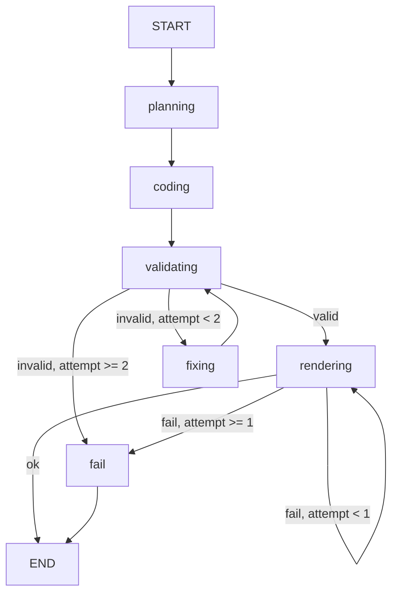

# 05 · 工作流与 Agent 设计

> 本文档是**最核心的架构文档**，定义了 ThinkCanvas 的"大脑"是怎么工作的。

## 🎯 设计目标

1. **流程可控**：每一步出错都能定位、能修
2. **可扩展**：v0.2+ 加新 Agent / 渲染器不破坏现有代码
3. **可调试**：能看每一步的输入输出、LLM 实际调用
4. **可重试**：错误能自动恢复，不是一次失败就完蛋

## 🧠 选型：LangGraph

| 候选 | 优点 | 缺点 | 决策 |
|---|---|---|---|
| **LangGraph** ✅ | 状态机原生、可视化好、LangChain 生态、Conditional edge、Human-in-the-loop | 多一层依赖 | **选这个** |
| 自研状态机 | 依赖少、灵活 | 至少 1000 行样板代码 | ✗ |
| Temporal | 工业级 | 太重、学习曲线陡 | ✗ |

**LangGraph 核心能力正好对得上**：
- ✅ 状态机（StateGraph）
- ✅ 条件分支（conditional edges）
- ✅ 循环（Fix loop）
- ✅ 持久化（checkpointer，用于任务恢复）
- ✅ 可视化（`graph.get_graph().draw_mermaid()`）

## 🔄 状态机设计

### 状态定义

```python
# workflow/state.py
from typing import TypedDict, Optional, Annotated
from operator import add
import operator


class TaskState(TypedDict):
    """贯穿整个工作流的全局状态"""

    # --- 输入 ---
    task_id: str
    prompt: str                       # 用户原始输入
    options: dict                     # { quality, style, ... }

    # --- 规划阶段产物 ---
    plan: Optional[dict]              # Planner Agent 输出
    few_shot_ids: list[str]           # 选中的 few-shot 例子 ID

    # --- 代码阶段产物 ---
    code: Optional[str]               # 当前代码
    code_history: Annotated[list[dict], add]   # 历史（带错误）
    code_attempt: int                 # 当前重试次数

    # --- 验证阶段产物 ---
    validation_errors: list[str]      # 校验错误

    # --- 渲染阶段产物 ---
    render_output: Optional[str]      # 视频文件路径
    render_history: Annotated[list[dict], add]
    render_attempt: int

    # --- 元信息 ---
    error: Optional[str]              # 最终错误（如果有）
    state: str                        # 当前节点名（用于推送进度）
```

### 节点定义

```python
# workflow/nodes/planning.py
async def planning_node(state: TaskState) -> TaskState:
    """理解用户意图，选 few-shot，决定风格"""
    plan = await planner_agent.run(state["prompt"])
    few_shot = select_few_shot(plan["algorithm"], state["prompt"])
    return {
        **state,
        "plan": plan.dict(),
        "few_shot_ids": few_shot,
        "state": "PLANNING_DONE",
    }


# workflow/nodes/coding.py
async def coding_node(state: TaskState) -> TaskState:
    """调 LLM 生成 Manim 代码"""
    code = await coder_agent.run(
        prompt=state["prompt"],
        plan=state["plan"],
        few_shot_ids=state["few_shot_ids"],
        prev_error=last_error(state),  # 如果是 fix 重试
    )
    return {
        **state,
        "code": code,
        "code_attempt": state.get("code_attempt", 0) + 1,
        "code_history": [{"code": code, "prev_error": last_error(state)}],
        "state": "CODING_DONE",
    }


# workflow/nodes/validating.py
async def validating_node(state: TaskState) -> TaskState:
    """AST/Regex 校验代码"""
    errors = validate_code(state["code"])
    return {
        **state,
        "validation_errors": errors,
        "state": "VALIDATED",
    }


# workflow/nodes/rendering.py
async def rendering_node(state: TaskState) -> TaskState:
    """执行 Manim 沙箱"""
    try:
        output_path = await manim_renderer.render(
            code=state["code"],
            options=state["options"],
            timeout=60,
        )
        return {
            **state,
            "render_output": output_path,
            "state": "RENDERED",
        }
    except RenderError as e:
        return {
            **state,
            "render_attempt": state.get("render_attempt", 0) + 1,
            "render_history": [{"error": str(e)}],
            "state": "RENDER_FAILED",
        }
```

### 边（条件路由）

```python
# workflow/graph.py
from langgraph.graph import StateGraph, END


def should_fix_code(state: TaskState) -> str:
    """校验失败时决定:重试 or 失败"""
    if not state["validation_errors"]:
        return "rendering"

    if state["code_attempt"] >= MAX_CODE_RETRIES:  # 2
        return "fail"

    return "fixing"


def should_retry_render(state: TaskState) -> str:
    """渲染失败时决定:重试 or 失败"""
    if state.get("render_output"):
        return "done"

    if state["render_attempt"] >= MAX_RENDER_RETRIES:  # 1
        return "fail"

    return "rendering"  # 直接重试，绕开 coding 阶段


# 构图
graph = StateGraph(TaskState)

graph.add_node("planning", planning_node)
graph.add_node("coding", coding_node)
graph.add_node("fixing", fixing_node)        # 代码修复
graph.add_node("validating", validating_node)
graph.add_node("rendering", rendering_node)
graph.add_node("fail", fail_node)            # 最终失败

# 边
graph.set_entry_point("planning")
graph.add_edge("planning", "coding")
graph.add_edge("coding", "validating")
graph.add_conditional_edges(
    "validating",
    should_fix_code,
    {
        "rendering": "rendering",
        "fixing": "fixing",
        "fail": "fail",
    },
)
graph.add_edge("fixing", "validating")       # fix 完再校验
graph.add_conditional_edges(
    "rendering",
    should_retry_render,
    {
        "done": END,
        "rendering": "rendering",
        "fail": "fail",
    },
)
graph.add_edge("fail", END)

app = graph.compile()
```

### 状态机可视化

```python
# 在 Jupyter 里看
mermaid = app.get_graph().draw_mermaid()
print(mermaid)
```

输出大致是：



## 🤖 Agent 设计

### v0.1：一个 Coder Agent 搞定

**单一职责**：给定 prompt + plan + few-shot → 输出 Manim 代码

```python
# agents/coder.py
class CoderAgent:
    def __init__(self, llm: BaseLLMClient, prompt_loader: PromptLoader):
        self.llm = llm
        self.prompt_loader = prompt_loader

    async def run(
        self,
        prompt: str,
        plan: dict,
        few_shot_ids: list[str],
        prev_error: Optional[str] = None,
    ) -> str:
        system = self.prompt_loader.load_system()
        examples = self.prompt_loader.load_examples(few_shot_ids)

        user_msg = build_user_message(prompt, plan, prev_error)

        code = await self.llm.generate(
            system=system,
            examples=examples,
            user=user_msg,
        )

        return clean_code(code)  # 去掉 markdown 等
```

### v0.2+：拆成多个 Agent

**为未来预留的接口**：

```python
# agents/base.py
from abc import ABC, abstractmethod


class BaseAgent(ABC):
    """所有 Agent 的基类"""

    name: str
    description: str

    @abstractmethod
    async def run(self, state: TaskState) -> TaskState:
        """执行 Agent 逻辑，返回更新后的 state"""
        ...


# agents/registry.py（未来用，v0.1 留空）
class AgentRegistry:
    """Agent 注册表，方便多 Agent 协作时查找"""

    _agents: dict[str, BaseAgent] = {}

    @classmethod
    def register(cls, agent: BaseAgent):
        cls._agents[agent.name] = agent

    @classmethod
    def get(cls, name: str) -> BaseAgent:
        return cls._agents[name]
```

**未来可能的 Agent 拆分**：

| Agent | 职责 | 何时拆分 |
|---|---|---|
| **PlannerAgent** | 理解意图、分解任务、选 few-shot | v0.2（当 prompt 复杂度上去时） |
| **CoderAgent** | 写代码 | v0.1（主 Agent） |
| **ReviewerAgent** | review 代码、检查算法正确性 | v0.5（当质量要求高时） |
| **FixerAgent** | 修 bug | v0.5（独立出来便于 prompt 优化） |
| **StylistAgent** | 调色、字体、布局 | v1.0（用户自定义风格时） |
| **NarratorAgent** | 加旁白/字幕 | v1.0 |

**拆分原则**：只有当 prompt 变长、效果变差时，才拆。

## 🛠 Tool 抽象

Agent 调用的"工具"，每个 tool 是一个**确定性函数**（不调 LLM）：

```python
# tools/base.py
from abc import ABC, abstractmethod
from pydantic import BaseModel


class BaseTool(ABC):
    name: str
    description: str

    @abstractmethod
    async def execute(self, **kwargs) -> dict:
        ...


# tools/llm.py
class LLMCallTool(BaseTool):
    """调 LLM"""
    name = "llm_call"

    async def execute(self, system: str, user: str) -> dict:
        ...


# tools/validator.py
class CodeValidatorTool(BaseTool):
    """校验 Manim 代码"""
    name = "validate_code"

    async def execute(self, code: str) -> dict:
        errors = []
        # AST 检查
        # 危险模式检查
        # 必须的 import 检查
        return {"valid": len(errors) == 0, "errors": errors}


# tools/renderer.py
class RendererTool(BaseTool):
    """执行 Manim 渲染"""
    name = "render"

    async def execute(self, code: str, options: dict) -> dict:
        ...
```

**Agent 不直接调底层服务**，**通过 Tool**。这样：
- 容易单测（mock tool）
- 容易换实现
- Tool 复用

## 🔌 完整的可插拔设计

### LLM 抽象
```python
# llm/base.py
class BaseLLMClient(ABC):
    @abstractmethod
    async def generate(
        self,
        system: str,
        user: str,
        examples: list[dict] = None,
        **kwargs,
    ) -> str: ...


# llm/factory.py
def get_llm_client(provider: str = None) -> BaseLLMClient:
    provider = provider or settings.DEFAULT_LLM_PROVIDER
    if provider == "deepseek":
        return DeepSeekClient()
    elif provider == "openai":
        return OpenAIClient()
    # 未来：claude, qwen, ollama, ...
    raise ValueError(f"Unknown provider: {provider}")
```

### Renderer 抽象
```python
# renderers/base.py
class BaseRenderer(ABC):
    @abstractmethod
    async def render(
        self,
        code: str,
        options: dict,
    ) -> RenderResult: ...


# renderers/manim.py
class ManimRenderer(BaseRenderer):
    async def render(self, code, options):
        # subprocess 跑 manim
        ...


# 未来：renderers/svg.py、renderers/remotion.py
```

### Storage 抽象
```python
# storage/base.py
class BaseStorage(ABC):
    @abstractmethod
    async def save(self, key: str, data: bytes) -> str: ...
    @abstractmethod
    async def load(self, key: str) -> bytes: ...
    @abstractmethod
    async def url(self, key: str, expires: int = 3600) -> str: ...


# storage/local.py
# storage/s3.py
# storage/oss.py（阿里云）
```

## 📊 端到端数据流（更新版）

```
[1] 用户 POST /api/generate { prompt, options }
    ↓
[2] FastAPI → 创建 Task → 入队 Redis
    ↓
[3] RQ Worker 拉取任务
    ↓
[4] LangGraph 执行
    planning → coding → validating → rendering → END
                  ↑ (fix loop)        ↑ (retry)
    ↓
[5] 状态推 WebSocket
    ↓
[6] 用户在 Web 看到视频
```

## 🧪 可测试性

每个节点、每个 Agent、每个 Tool **都可以独立单测**：

```python
# tests/workflow/test_coding_node.py
async def test_coding_node():
    state = TaskState(prompt="冒泡排序", plan={...}, few_shot_ids=["bubble"])
    result = await coding_node(state)
    assert "from manim import" in result["code"]
    assert "class BubbleSort" in result["code"]


# tests/agents/test_coder_agent.py
async def test_coder_agent_with_mock_llm():
    mock_llm = MockLLM(return_value="from manim import *\n...")
    agent = CoderAgent(mock_llm, prompt_loader)
    code = await agent.run("test", {}, [])
    assert "class " in code
```

## 🚀 演进路径

| 版本 | 工作流 | Agent 数 |
|---|---|---|
| **v0.1** | 单线：planning → coding → validating → rendering | 1 (Coder) |
| **v0.5** | + Reviewer 节点 | 2 (Coder + Reviewer) |
| **v1.0** | + 条件分支（不同算法用不同 few-shot 集） | 3 (Planner + Coder + Reviewer) |
| **v2.0** | + 多轮交互（用户迭代修改） | 4+ |

## ❓ 待回答的设计问题

- [ ] Fixer Agent 是独立还是 Coder 加个"fix mode"？
- [ ] LLM 输出格式：纯文本 vs JSON vs structured output？
- [ ] Code 历史要保存几份？（影响 token 成本）
- [ ] 任务状态要不要持久化到 Postgres？（v0.1 可以只用 Redis）
- [ ] WebSocket 推送是 LangGraph 自带还是单独写？
